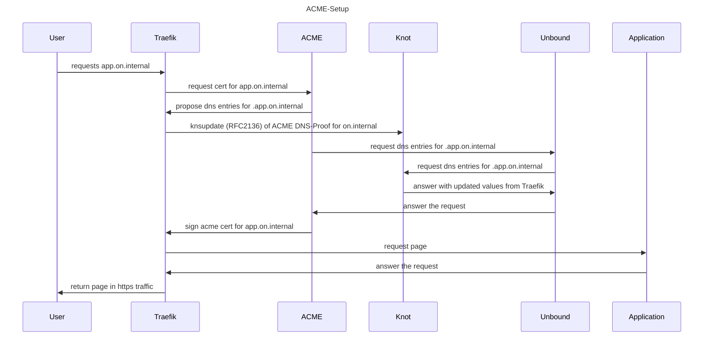

# Networking

## Internal Networks

**10.87.X.X - 10.89.X.X** are used as defaults for internal networking

| network name | network range | Description |
|---|---|---|
| `.internal` | 10.87.240.1/24 | bridge with dns support |
| `.nspawn` | 10.87.241.1/24 | bridge with dns support, dns for `.nspawn` container |
| `.podman[1-99]` | 10.88.0.1-99/16 | bridge with dns support, dns for `.podman` container |

## DNS-Resolver

DNS (+dnssec) Resolver for System, Container, Compose and Nspawn workloads is done using `Unbound`.

- available as `dns.internal`, `dns.podman`, `dns.nspawn`
- under `INTERNAL_CIDR|cidr2ip(0)` on `udp/53`, `tcp/53` and `DoT:tcp/853`
- default upstream is **split round robin DoT (DNS over TLS)**
    - over 2x dns.google, 2x dns-unfiltered.adguard.com, 2x cloudflare-dns.com
- dynamic name and reverse ptr resolution for
    - `.internal` local Workloads
    - `.podman` Container and Compose workloads
    - `.nspawn` Machine Container
- `INTERNAL_CIDR|cidr2ip(0)`: self.internal , dns.internal
- `NSPAWN_CIDR|cidr2ip(0)`: self.nspawn , dns.nspawn
- `PODMAN_CIDR|cidr2ip(0)`: self.podman , dns.podman

Documentation:

- [Unbound Documentation](https://unbound.docs.nlnetlabs.nl/en/latest/)

### Container Naming

- podman container are available in DNS as `containername.podman`
- podman compose container are available in DNS as `composename_servicename_index.podman`
- systemd podman quadlet container will have "systemd-" prefixed to its name, eg: `systemd-frontend.podman`
- systemd nspawn machines are available under `machinename.nspawn`

Examples:

```sh
ping systemd-postgresql.podman
ping hello-nspawn.nspawn
ping hello-compose_backend_1.podman
```


### Examples

#### forward custom zones to another dns server

```yaml
DNS_RESOLVER:
  FORWARD:
    - name: lan
      addr: 127.0.0.1@5353
      tls: false
    - name: 30.9.10.in-addr.arpa
    - addr: 127.0.0.1@5353
      tls: false
```

#### add custom zone entries and public dns overrides

```yaml
DNS_RESOLVER:
  SRV: |
    # STRING, appended to SRV section

    # A Record
    local-data: 'somecomputer.local. A 192.168.1.1'

    # PTR Record
    local-data-ptr: '192.168.1.1 somecomputer.local.'

    # local zone '.whatever'
    local-zone: 'whatever.' static
    local-data: 'me.whatever. A 192.168.2.1'

    # additional access control
    access-control: 192.168.2.0/24 allow

    # override public dns entry
    local-data: 'checkonline.home-assistant.io. 300 IN A 1.2.3.4'

```

#### use non tls custom upstream

```yaml
DNS_RESOLVER:
  UPSTREAM:
    # list of ip@port
    - 1.2.3.4@53
  UPSTREAM_TLS: false
```

#### add custom unbound config string

```yaml
DNS_RESOLVER:
  EXTRA: |
    # STRING, appended to config file must start with a section
    [section-of-unbound.conf]
    # see https://unbound.docs.nlnetlabs.nl/en/latest/

```

## local DNS-Server (knot)

- if LOCAL_DNS_SERVER["ENABLED"]
    - requests to internal domains are gathered from an local knot DNS server instance
    - its available as `knot.internal` under `INTERNAL_CIDR|cidr2ip(1)` on `udp/53`, `tcp/53`
    - it provides name resolution with **dnssec** for
        - `.internal` local Workloads
        - `.podman` Container and Compose workloads
        - `.nspawn` Machine Container
    - [Knot Documentation](https://www.knot-dns.cz/docs/latest/html/)

- if not the internal dns_resolver will have entries for this domains

## local ACME-Server (step-ca)

- if LOCAL_ACME_SERVER["ENABLED"]
    - step-ca will be used for maintaining `*.on.internal` TLS certificates
    - needs LOCAL_DNS_SERVER to be enabled too
    - [Step-CA Documentation](https://smallstep.com/docs/step-ca/getting-started/)



## tls/http Web-Frontend

`traefik` is used for tls termination, http routing, middleware frontend,
for dynamic configuration of container, compose and nspawn machines using labels.

Documentation:

- [Traefik Documentation](https://doc.traefik.io/traefik/)

### Customization

#### custom entrypoints and published ports

```yaml
FRONTEND:
  ENTRYPOINTS:
    tang_https:
      address: ":9443"
      http:
        tls:
          options: mtls@file
  PUBLISHPORTS:
    - "9943:9943"
```

#### custom providers

```yaml
FRONTEND:
  PROVIDERS:
    file:
      directory: /traefik
      watch: true
```

#### additional traefik config string

```yaml
FRONTEND:
  EXTRA: |
    # STRING, appended to traefik.static.yml

```

### Web Usage Examples

#### Single Container

- add environment for `instance` in `/etc/containers/environment/` *instance*`.env`

```sh
HOSTNAME=instance.hostname.domain
```

- use **`${HOSTNAME}`** for hostname

- add Label in *instance*`.container`

```ini
[Container]
Label=traefik.enable=true
Label=traefik.http.routers.instance.rule=Host(`${HOSTNAME}`)
Label=traefik.http.routers.instance.entrypoints=https

# use [Container]EnvironmentFile= ... if you need environment inside the container
# EnvironmentFile=/etc/containers/environment/%N.env

[Service]
# use [Service]EnvironmentFile= ... if you need environment in the systemd service
EnvironmentFile=/etc/containers/environment/%N.env

```

#### Compose Container

- add environment for `instance` in `/etc/compose/environment/` *instance*`.env`

```sh
HOSTNAME=instance.hostname.domain
```

- add labels and expose for `instance` in compose.yml
- use **`${HOSTNAME}`** for hostname

```yaml
services:
  thisservice:
    expose:
      - 8080
    labels:
      - "traefik.enable=true"
      - "traefik.http.routers.instance.rule=Host(`${HOSTNAME}`)"
      - "traefik.http.routers.instance.entrypoints=https"
      # - "traefik.http.services.instance.loadbalancer.server.port=8080"
      # not needed if exposing a single port
```

#### Nspawn Machine

- add labels and expose for `instance` in `/etc/nspawn/environment/` *instance*`.env`
- use `{{ HOSTNAME }}` for hostname
- use `$IPADDR` inside NSPAWN_TRAEFIK to replace with the current machine ip
- escape backticks ` with two backslashes \\\\

```sh
NSPAWN_TRAEFIK="
http:
  routers:
    instance:
      rule: Host(\\`instance.{{ HOSTNAME }}\\`)
      service: instance
      entrypoints: https
  services:
    instance:
      loadBalancer:
        servers:
          - url: http://$IPADDR:80/
"
```
